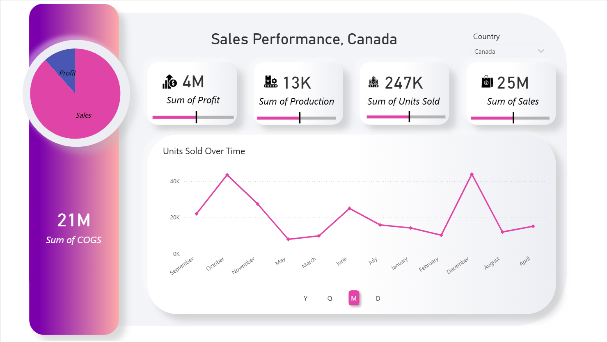

# 📊 Power BI Sales Dashboard



## 🧾 Overview
This project presents a **Sales Performance Dashboard** built using Power BI to analyze key business metrics and trends.

The dashboard provides a clear and interactive view of performance across sales, profit, production, and units sold.

---

## 🎯 Objectives
- Track overall business performance
- Compare **Sales vs Profit**
- Analyze **monthly trends in units sold**
- Provide a clean and intuitive interface for decision-making

---

## 📈 Key Features
- 📌 KPI Cards for quick insights (Sales, Profit, Production, Units Sold)
- 📊 Time-series analysis (Units Sold Over Time)
- 🌍 Country-based filtering
- 🎨 Clean, modern UI/UX design

---

## 💡 Insights
- Sales significantly exceed profit, indicating potential margin optimization opportunities  
- Units sold show noticeable fluctuations, suggesting seasonal demand patterns  
- KPI tracking allows quick performance monitoring across key metrics  

---

## 🛠 Tools & Technologies
- **Power BI Desktop**
- **DAX (Data Analysis Expressions)**
- **Power Query**

---

## 📁 Repository Structure

```
PowerBI-Sales-Dashboard
 ┣ 📄 Sample_Sales_Dashboard.pbix
 ┣ 🖼️ Sales_Dashboard.png
 ┣ 📄 README.md
```